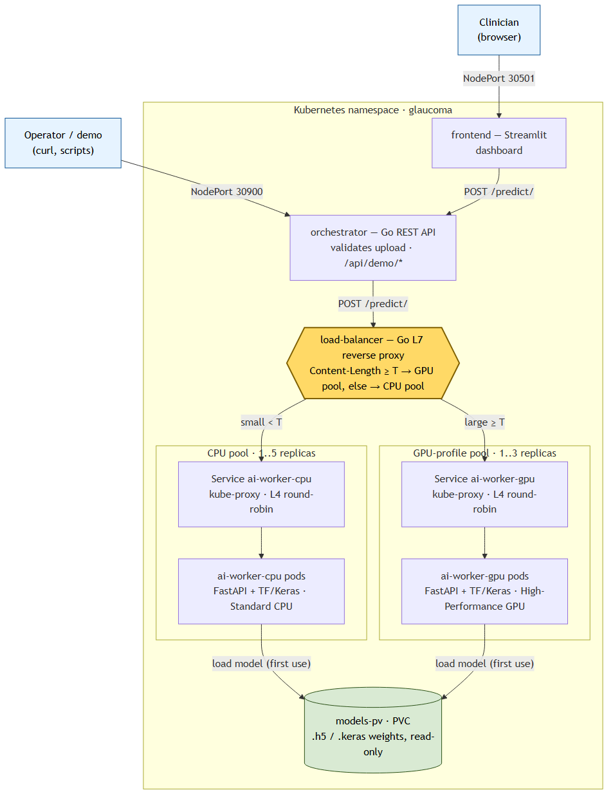
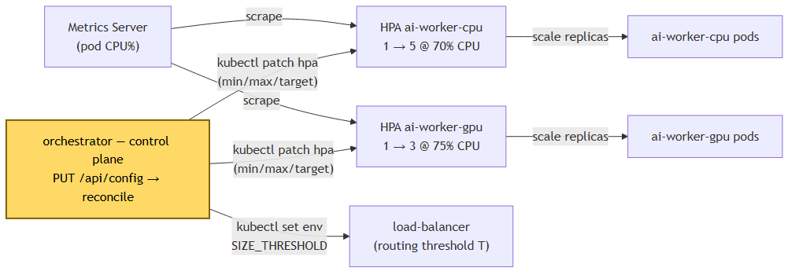

# Glaucoma Detection Cloud Ecosystem — Project Documentation

**Team:** Ilia Sukhina, Yevhenii Severin, Adam Partl
**Course:** Cloud Computing — Project 1

**Repository:** [`load_balancer/`](load_balancer/), [`orchestrator/`](orchestrator/), [`cloud_ai_worker/`](cloud_ai_worker/), [`cloud_frontend_app/`](cloud_frontend_app/), [`k8s/`](k8s/); supporting docs [`README.md`](README.md), [`EDGE_CASES.md`](EDGE_CASES.md), [`LOAD_BALANCER_COMPARISON.md`](LOAD_BALANCER_COMPARISON.md).

## Contents

1. [Project Goal and Focus](#1-project-goal-and-focus)
2. [Domain / Problem-Area Characterization](#2-domain--problem-area-characterization)
3. [Analysis of Similar Solutions and How Ours Differs](#3-analysis-of-similar-solutions-and-how-ours-differs)
4. [Concept — Architecture, Views, and Technical Analysis](#4-concept--architecture-views-and-technical-analysis)
5. [Detailed Technical Implementation Description](#5-detailed-technical-implementation-description)
6. [Experiment — Verifying the Stated Goal](#6-experiment--verifying-the-stated-goal)
7. [Conclusion and Future Work](#7-conclusion-and-future-work)
8. [Work Distribution](#8-work-distribution)
9. [Appendix — Related documents](#appendix--related-documents)

---

## 1. Project Goal and Focus

### 1.1 Motivation

Glaucoma is a leading cause of irreversible blindness. Screening from retinal *fundus photographs* works but is slow: a human grader must look at every image.

The hard part is **not** the AI model — a Convolutional Neural Network (CNN) classifies one image in well under a second. The hard part is **delivering that inference reliably and elastically at clinic scale**:

* many uploads arrive at the same time;
* images vary wildly in size (a phone snapshot vs. a 4K fundus-camera export);
* a heavy TensorFlow process must not crash a web server with an Out-Of-Memory error.

So this is **a cloud-infrastructure project, not a medical-accuracy project**. We build the plumbing that runs a glaucoma CNN as a horizontally scalable, resource-aware, self-tunable service on Kubernetes.

### 1.2 Project focus

A **cloud-native microservice ecosystem** that:

1. Serves a glaucoma-detection CNN as an independent, statelessly scalable inference microservice.
2. Routes traffic to the *right class of worker* by request cost — small images go to a cheap CPU pool, large images go to a GPU-profile pool — using a **custom Layer-7 (HTTP) load balancer**. This is the cloud-functionality component we implement ourselves.
3. Autoscales each worker pool independently with the Kubernetes **HorizontalPodAutoscaler (HPA)**.
4. Exposes a **control-plane orchestrator** (REST API) that re-tunes routing thresholds, HPA min/max replicas and upload safeguards *at runtime* (validated, persisted), and runs a built-in synthetic load test.
5. Provides a decoupled **Streamlit dashboard** for medical staff.

### 1.3 Measurable objectives

The assignment asks for at least one measurable goal. We define five, all verified by one scripted experiment ([`test_scalability_e2e.sh`](test_scalability_e2e.sh)) — see [§6](#6-experiment--verifying-the-stated-goal).

| # | Objective | Pass criterion | Measured by |
|---|---|---|---|
| **M1** | Resource-aware routing works | 100 % of small requests (< 2.5 MB) reach the CPU pool, and 100 % of large requests (≥ 2.5 MB) reach the GPU pool | `node_type` in each `/predict/` response + load-balancer logs |
| **M2** | CPU pool autoscales under load | `ai-worker-cpu` grows from `1` to `≥ 2` replicas under sustained load, then scales back down | `kubectl -n glaucoma get hpa/pods`, sampled during the test |
| **M3** | GPU pool autoscales under load | `ai-worker-gpu` grows from `1` to `≥ 2` replicas under sustained large-image load | same as M2 |
| **M4** | Load is spread across the new replicas | ≥ 2 distinct worker pod IDs serve requests for each pool | `worker_id` in the `worker_spread` map from `/api/demo/loadtest` |
| **M5** | Runtime reconfiguration takes effect | After `PUT /api/config {"size_threshold_bytes": …}`, a borderline-sized request changes pool | orchestrator `/api/status` + a follow-up `/api/demo/predict` showing `routed_to_pool` |

A successful run prints the verdict block shown in [§6.4](#64-expected-result-success-criterion).

---

## 2. Domain / Problem-Area Characterization

### 2.1 Application domain — medical image screening

* **Input:** retinal fundus photographs (JPEG/PNG), very different in resolution and file size. The CNN expects a fixed `224 × 224 × 3` tensor, so every image is resized server-side. Result: the compute cost per request is roughly constant once the image is decoded, but the network + decode cost grows with file size — and large images are the ones that put memory pressure on a worker.
* **Output:** a probability in `[0, 1]` (likelihood of glaucoma), shown to the clinician as a percentage plus a clinical band — "Low Risk" / "Suspicious" / "High Risk".
* **Non-functional needs:** availability during screening campaigns; elasticity (load is bursty); isolation (a model crash must not take down the UI); observability (an audit trail of which node/pod handled a given medical request); and safety on untrusted uploads (size limits, type checks, decompression-bomb guards).

### 2.2 Cloud-computing domain — the parts we build

| Cloud concept | Where it appears in this project |
|---|---|
| **Containerization (Docker)** | Every service ships as a Docker image; multi-stage Alpine builds keep the Go services ~10 MB. |
| **Container orchestration (Kubernetes)** | One `glaucoma` namespace; Deployments + Services; a PersistentVolume for model files; NodePort ingress for the UI and the orchestrator. |
| **Microservices architecture** | 5 independently deployable services. |
| **Elastic horizontal autoscaling** | Two `HorizontalPodAutoscaler` objects driven by the Metrics Server. |
| **Layer-7 / application-aware load balancing** | **Our own Go reverse proxy**, routing on `Content-Length` — *the self-implemented cloud-functionality component*. |
| **Control plane / Infrastructure-as-an-API** | The Go **orchestrator** — a REST API that changes cluster state (HPA bounds, LB env) via `kubectl` and persists its config to a volume. |
| **Stateless service design** | Workers hold only a rebuildable model cache; any pod can serve any request. |

### 2.3 Why resource-aware routing is the interesting cloud problem here

A plain Kubernetes `Service` load-balances **between identical replicas of one pool** (Layer 4, round-robin). It cannot look at an HTTP request and decide *which pool* should handle it.

But our workload genuinely has two cost classes — small vs. large images — and we want them on different node profiles for cost and stability reasons. Bridging that gap (a Layer-7 decision *in front of* the Layer-4 mechanics) is the functionality we implement ourselves. The algorithm is in [§4.3.1](#431-the-l7-routing-algorithm-go-reverse-proxy), the full write-up in [§5.3](#53-the-self-implemented-cloud-functionality-component--the-go-l7-load-balancer), and the build-vs-buy comparison in [`LOAD_BALANCER_COMPARISON.md`](LOAD_BALANCER_COMPARISON.md).

---

## 3. Analysis of Similar Solutions and How Ours Differs

### 3.1 Comparable approaches

The full trade-off analysis is in [`LOAD_BALANCER_COMPARISON.md`](LOAD_BALANCER_COMPARISON.md); the summary:

| Approach | What it offers | Why it does not directly fit |
|---|---|---|
| **Plain K8s `Service` + kube-proxy** | Layer-4 load balancing across identical pods | Content-agnostic — cannot route by request body size; picks a *pod*, never a *pool*. |
| **Kubernetes HPA alone** | Elastic replica count per Deployment | Orthogonal — decides *how many* pods, never *which* pod or pool. |
| **Ingress controller (NGINX / Traefik / Envoy / HAProxy)** | Mature Layer 7: TLS, host/path routing, retries, rate limiting | No body-size matcher out of the box — needs custom Lua / `EnvoyFilter` plus a ~100 MB controller. |
| **Service mesh (Istio / Linkerd)** | Fine-grained Layer-7 traffic policy + observability | Even heavier; still no body-size matcher; overkill for 5 services. |
| **Managed model endpoints (SageMaker / Vertex AI / Azure ML)** | Managed autoscaling inference, A/B traffic splitting | Vendor lock-in; the assignment asks us to *implement* a component, not consume one; no "route by upload size" knob. |
| **Generic API gateways (Kong / KrakenD)** | Plugin-based Layer-7 routing | Request-size routing is, at best, a custom plugin — another component to run. |

### 3.2 How our solution differs

* **The routing primitive is the differentiator.** The whole CPU/GPU decision is four lines of Go (`if r.ContentLength >= threshold { gpuProxy } else { cpuProxy }`) in an ~80-line, ~10 MB Alpine container — versus a 100 MB Ingress controller plus custom Lua/Envoy config spread across annotations, a ConfigMap and Helm values.
* **Two complementary layers, cleanly separated.** Our Go LB owns the *domain decision* (which pool); kube-proxy owns the *infrastructure mechanic* (which pod); HPA owns *how many pods*. None replaces the others — see [§4.1](#41-base-architecture-diagram).
* **A real control plane for the demo.** The **orchestrator** re-tunes the routing threshold, HPA min/max, target utilization and upload safeguards *at runtime* (validated, persisted, reconciled via `kubectl`), plus a built-in synthetic load tester that reports latency percentiles and per-pod spread — exactly what [§6](#6-experiment--verifying-the-stated-goal) exercises.
* **Portability.** The LB is a tiny standalone binary, so the identical routing logic runs under `docker compose` locally and under Kubernetes in the cloud deployment. An Ingress-based design would be Kubernetes-only.
* **Honest scope.** We do *not* claim mesh-grade features (TLS termination, retries, circuit breakers, rate limiting) — see [§5.2](#52-limitations--boundaries-of-the-solution). The point is to demonstrate the cloud mechanics, not to re-implement Envoy.

---

## 4. Concept — Architecture, Views, and Technical Analysis

### 4.1 Base architecture diagram

**(a) Request data path and topology.** The highlighted node is the self-implemented cloud-functionality component ([§4.3.1](#431-the-l7-routing-algorithm-go-reverse-proxy), [§5.3](#53-the-self-implemented-cloud-functionality-component--the-go-l7-load-balancer)). Mermaid source: [`docs/arch-a.mmd`](docs/arch-a.mmd).



**(b) Control & scaling plane** (runs alongside the data path above). Mermaid source: [`docs/arch-b.mmd`](docs/arch-b.mmd).



**Predict flow:** clinician/operator → orchestrator (validate) → load-balancer → (size check) → CPU or GPU Service → worker pod → `model.predict` → JSON.

**Responsibility split:** the Go LB picks the **pool** (Layer 7) · kube-proxy picks the **pod** in that pool (Layer 4) · HPA decides **how many** pods per pool · the orchestrator **re-tunes** all of the above at runtime.

### 4.2 Architectural views

#### 4.2.1 Logical / decomposition view — the five microservices

| Service | Tech | What it does |
|---|---|---|
| **Frontend** | Python / Streamlit ([`cloud_frontend_app/app.py`](cloud_frontend_app/app.py)) | Clinician dashboard: upload a fundus image, pick a model (`GET /models/`), call `POST /predict/`, show the probability, the clinical band, and the infrastructure telemetry (`node_type`, `worker_id`, `execution_time`). Fully decoupled — it knows one backend URL and does no routing. |
| **Orchestrator** | Go ([`orchestrator/`](orchestrator/)) | Control plane / Infrastructure-as-an-API. Owns one validated, persisted JSON config. `PUT /api/config` reconciles the cluster (`kubectl patch` the HPAs, `kubectl set env` the LB). Runs the demo (`POST /api/demo/predict`, `POST /api/demo/loadtest`), reports `GET /api/status`, validates uploads *before* the LB. Algorithm: [§4.3.4](#434-the-control-plane-algorithm--orchestrator-config-reconciliation). |
| **Load balancer** | Go ([`load_balancer/main.go`](load_balancer/main.go)) | The self-implemented cloud-functionality component — a Layer-7 reverse proxy. `POST /predict/` with `Content-Length ≥ SIZE_THRESHOLD` → GPU backend, else → CPU backend; `GET /models/` → CPU backend; `GET /health` → `{"status":"ok"}`. Logs every routing decision. Stateless, four env vars. Algorithm: [§4.3.1](#431-the-l7-routing-algorithm-go-reverse-proxy); full write-up: [§5.3](#53-the-self-implemented-cloud-functionality-component--the-go-l7-load-balancer). |
| **AI worker — CPU** | Python / FastAPI + TensorFlow/Keras ([`cloud_ai_worker/main.py`](cloud_ai_worker/main.py)) | Inference microservice on the cost-effective node profile. Lazy-loads and caches Keras models, resizes the image to `224×224×3`, runs `model.predict`, returns the probability plus `node_type`, `worker_id` (pod hostname) and `execution_time`. Cheap `/health` (no TensorFlow load). Algorithm: [§4.3.5](#435-the-inference-algorithm--cnn-on-the-worker-fastapi--tensorflowkeras). |
| **AI worker — GPU** | same image as the CPU worker | Same code, deployed with `NODE_TYPE="High-Performance GPU"` and its own Deployment/Service/HPA, so high-resolution images land on accelerated nodes without competing with the high-throughput CPU pool. |

#### 4.2.2 Deployment / physical view

The Kubernetes objects and how they wire up are summarized below; the diagram shows the same picture with the data path (solid arrows) and the control / scaling plane (dashed arrows) drawn on top of each other. Mermaid source: [`docs/deployment.mmd`](docs/deployment.mmd).


| Object | What it is | Why it is there |
|---|---|---|
| Namespace `glaucoma` | One Kubernetes namespace holding everything | On minikube it is a single node, but the design is multi-node-ready — in a real cluster the CPU and GPU Deployments would carry different `nodeSelector`/taints. |
| Deployments + Services | `ai-worker-cpu`, `ai-worker-gpu`, `load-balancer`, `frontend` (NodePort `30501`), `orchestrator` (NodePort `30900`) | The running services; NodePort exposes the UI and the orchestrator API outside the cluster. |
| PersistentVolume `models-pv` + PersistentVolumeClaim (PVC) | Holds the `.h5`/`.keras` model weights, mounted read-only into the worker pods | Model files are deliberately *not* in Git (too large) — supplied via `models.zip` + [`prepare_models.sh`](prepare_models.sh) locally, or via PV / object storage / Git LFS in production. |
| ServiceAccount + role-based access control (RBAC) | A ServiceAccount for the orchestrator with `patch` rights on HPAs and Deployments in the namespace | Lets the orchestrator reconcile cluster state with `kubectl` without cluster-admin rights. |
| Metrics Server | Cluster add-on that reports pod CPU usage | Required by HPA; on minikube, `minikube addons enable metrics-server`. |

#### 4.2.3 Process / runtime view — the predict request lifecycle

1. **Upload.** The clinician uploads an image → `POST /predict/` (multipart: `file`, `model_name`) to the configured backend URL — the orchestrator, or the LB directly in the bare stack.
2. **Validate** (when the orchestrator is in front). Size cap → content-type allowlist → magic-byte sniff → header-only dimension check → `model_name` sanitization. The exact chain is in [§4.3.4](#434-the-control-plane-algorithm--orchestrator-config-reconciliation) step 4. Failures → `413` / `415` / `400`.
3. **Route.** The orchestrator forwards to the load balancer, which reads `Content-Length`: `≥ threshold` → GPU proxy, else → CPU proxy. It logs `[route] POST /predict/ (<n> bytes) -> CPU|GPU`.
4. **Pick a pod.** The pool's Kubernetes Service (kube-proxy) forwards to one Ready worker pod (round-robin / random among the replicas).
5. **Infer.** The worker reads the bytes → resizes to `224×224`, normalizes to `[0,1]`, adds a batch dimension → `get_model(model_name)` (cache hit, or load from the PV on first use) → `model.predict(x)[0][0]` → optional synthetic CPU burn for the HPA demo → returns `{status, probability, node_type, worker_id, execution_time}`.
6. **Return.** The orchestrator wraps the response as `{orchestrator:{validated:{…}, routed_to_pool:"cpu|gpu"}, upstream:{…}}`; the UI shows the probability, the clinical band and the telemetry.

The same lifecycle as a UML sequence diagram — the `alt` block makes the L7 routing decision (small image → CPU pool, large image → GPU pool) explicit. Mermaid source: [`docs/sequence.mmd`](docs/sequence.mmd).


#### 4.2.4 Scaling / control view

* **Metrics Server** scrapes pod CPU. **HPA `ai-worker-cpu`:** 1 → 5 replicas at ≈70 % CPU. **HPA `ai-worker-gpu`:** 1 → 3 replicas at ≈75 % CPU. All four numbers are runtime-tunable through the orchestrator, within hard bounds (`[0,50]` replicas, `[1,100]` % utilization).
* Scale-up is not instant — until the new pods are `Ready`, traffic stays on the existing pods. Scale-down waits for the stabilization window. For minikube demos the workers set `LOAD_TEST_CPU_BURN_SECONDS=0.8` so inference creates measurable CPU pressure; set it to `0` for inference-only runs.
* The **orchestrator** is the human-facing control loop on top. `PUT /api/config` validates the merged config, persists it, and an `OnChange` hook runs `kubectl patch hpa …` + `kubectl set env deployment/load-balancer SIZE_THRESHOLD=…`. Reconcile errors are logged at `WARN` but the API still returns the new config; `/api/config/apply` force-reconciles; `/api/config/reset` restores defaults. Failure behaviour is catalogued in [`EDGE_CASES.md`](EDGE_CASES.md).

### 4.3 Detailed technical analysis of the chosen technology and its algorithms

The self-implemented component is the **Layer-7 resource-aware load balancer** (Go). Its decision is small, so we describe the "algorithm" together with the three cooperating layers.

#### 4.3.1 The L7 routing algorithm (Go reverse proxy)

In plain words: the load balancer is a tiny HTTP reverse proxy. For each `POST /predict/` request it reads the `Content-Length` header, and — without ever touching the body — forwards the request unchanged to either the GPU backend (if the upload is at or above a configurable byte threshold) or the CPU backend (otherwise). `GET /models/` always goes to the CPU backend; `GET /health` is answered locally. Every decision is logged. The whole core is these few lines:

```go
const defaultThreshold = 2_500_000 // bytes (~2.5 MB), overridable via SIZE_THRESHOLD

mux.HandleFunc("/predict/", func(w http.ResponseWriter, r *http.Request) {
    if r.ContentLength >= int64(threshold) {
        log.Printf("[route] %s %s (%d bytes) -> GPU", r.Method, r.URL.Path, r.ContentLength)
        gpuProxy.ServeHTTP(w, r)        // httputil.ReverseProxy to GPU_BACKEND
    } else {
        log.Printf("[route] %s %s (%d bytes) -> CPU", r.Method, r.URL.Path, r.ContentLength)
        cpuProxy.ServeHTTP(w, r)        // httputil.ReverseProxy to CPU_BACKEND
    }
})
mux.HandleFunc("/models/", /* always */ cpuProxy.ServeHTTP)
mux.HandleFunc("/health",  /* returns {"status":"ok"} */)
```

* **Why `Content-Length`?** It is in the request headers *before* the body is read, so the decision is constant-time with no buffering. File size is a good proxy for "a high-resolution fundus image that would put memory pressure on a CPU worker if many arrive at once" — the request we want on the GPU-profile pool.
* **`httputil.ReverseProxy`.** Go's standard-library proxy. We override the `Director` so the outgoing `Host` header is the backend's host (correct virtual hosting); the path and body pass through untouched. A backend failure yields a `502` — we do not retry (a deliberate, documented limitation; see [§5.2](#52-limitations--boundaries-of-the-solution)).
* **Statelessness and config.** Four env vars only — `CPU_BACKEND`, `GPU_BACKEND`, `SIZE_THRESHOLD`, `PORT`. No persistent state, so the LB pod is freely restartable; the orchestrator changes `SIZE_THRESHOLD` via `kubectl set env`, which triggers a brief rolling restart of the (single-replica) LB.

#### 4.3.2 The L4 layer — Kubernetes `Service` / kube-proxy

Each pool has a `ClusterIP` Service. kube-proxy programs iptables/IPVS rules that spread connections **across the Ready pods of that pool** (round-robin / random). It is content-agnostic — it never sees the HTTP body. That is exactly why the Layer-7 LB sits *in front of it*: the LB picks the **pool**, kube-proxy picks the **pod**.

#### 4.3.3 The autoscaling control algorithm — HorizontalPodAutoscaler

In plain words: every few seconds the HPA controller looks at how busy a pool's pods are (average CPU) and resizes the pool so that busyness lands near a target. Concretely it applies the standard ratio formula:

```text
desiredReplicas = ceil( currentReplicas × ( currentMetricValue / targetMetricValue ) )
```

clamped to `[minReplicas, maxReplicas]` (CPU `[1,5]` @ 70 %, GPU `[1,3]` @ 75 % by default). Scale-up is prompt but bounded by pod start time; scale-down is delayed by a stabilization window to avoid flapping. HPA is **orthogonal** to routing — it changes *how many* pods exist per pool, never *which* pod or pool a request hits. (The three layers in one line: **LB = which pool, kube-proxy = which pod, HPA = how many pods.**)

#### 4.3.4 The control-plane algorithm — orchestrator config reconciliation

1. **Accept the change.** `PUT /api/config` takes a *partial* JSON body. Unknown fields → `422` (so typos surface). A field explicitly set to `null` is a no-op.
2. **Validate the result.** The patch is merged onto the current config, then validation runs **on the merged result** — hard bounds plus cross-field rules (e.g. `cpu_min_replicas ≤ cpu_max_replicas`; each `allowed_content_types` entry must start with `image/`). Any violation → `422`, server state unchanged.
3. **Persist, then reconcile.** On success the config is written atomically to disk, then an `OnChange` hook reconciles the cluster: `kubectl patch hpa ai-worker-cpu / ai-worker-gpu` (new min/max/target) and `kubectl set env deployment/load-balancer SIZE_THRESHOLD=<n>`. Reconcile errors are logged at `WARN`; the API still returns the now-persisted config. `POST /api/config/apply` re-runs the reconciliation (useful right after deploy, or if `kubectl` was unavailable earlier) and returns `207 Multi-Status` with a per-step error list if any patch failed.
4. **Upload safeguard chain** (on `POST /api/demo/predict`, run before forwarding to the LB):
   1. size cap via a `limit+1` read — never buffers an oversized body → `413`;
   2. declared content-type must be in the allowlist → `415`;
   3. magic-byte sniff (`http.DetectContentType`) → `415`;
   4. header-only `image.DecodeConfig` to enforce `max_image_pixels` — **the decompression-bomb guard**: a 1 KiB PNG that *claims* 100 000 × 100 000 is rejected without allocating the pixel buffer → `413`;
   5. `model_name` sanitization — `[A-Za-z0-9._-]` only, no `..` segments → `400`.
5. **Synthetic load test** (`POST /api/demo/loadtest`):
   * fires `n` predict requests at the LB with the configured `concurrency`. Both are capped — `n ≤ max_loadtest_requests`, `concurrency ≤ max_loadtest_concurrency` — else `422` *before any traffic*;
   * if no `image_base64` is supplied it generates a tiny synthetic JPEG (zero prerequisites);
   * reports duration, throughput (requests per second), success/failure counts, latency percentiles (`min/avg/p50/p95/p99/max`), `node_distribution`, `worker_spread` (requests per worker pod — the key signal that HPA actually spread the load), and an HTTP `status_codes` breakdown;
   * a client disconnect lets in-flight requests finish, launches no new ones, and returns a partial report.

#### 4.3.5 The inference algorithm — CNN on the worker (FastAPI + TensorFlow/Keras)

| Step | Detail |
|---|---|
| **Model management** | Lazy loading + an in-process cache (`MODEL_CACHE` dict). On the first request for a filename the worker loads it from `MODEL_DIR` (the PV) with `load_model(path, compile=False)` — inference-only, so no optimizer state, less RAM, faster init. Later requests are cache hits. Supports `.h5`, `.keras`, and TF SavedModel directories. `GET /models/` lists the available files for the UI dropdown. |
| **Preprocessing** | `PIL.Image.open(BytesIO(bytes)).convert("RGB")` (normalizes grayscale/RGBA) → `resize((224,224))` (the CNN's expected input — typical for ResNet/VGG-style backbones) → `img_to_array(img) / 255.0` (normalize to `[0,1]`) → `np.expand_dims(..., axis=0)` (final shape `(1, 224, 224, 3)`). Done entirely in memory; the upload is never written to disk. |
| **Inference** | `model.predict(x)` returns a `(1,1)` array; the scalar is the glaucoma probability (×100 for the UI). The CNN is a standard image classifier: stacked convolution + pooling feature extractor → dense layers → sigmoid. The project consumes a *pre-trained* model file; training is out of scope. |
| **Telemetry** | Every response carries `node_type` (from `NODE_TYPE` — "Standard CPU" vs "High-Performance GPU"), `worker_id` (`socket.gethostname()` = the pod name — the audit trail and the scaling proof), and `execution_time` (server-measured inference latency). |
| **Health** | `GET /health` returns `{status, node_type, worker_id, model_dir}` *without* touching TensorFlow, so readiness probes stay cheap while pods are scaling. |
| **HPA demo aid** | `LOAD_TEST_CPU_BURN_SECONDS` (default `0`) optionally spins one core with deterministic floating-point work after `predict`, so a CPU-metric HPA on minikube sees measurable pressure. In production, leave it at `0`. |
| **Error handling** | A corrupted image, a missing model, etc. are caught and returned as `{status:"error", message:…}` rather than crashing the worker. |

---

## 5. Detailed Technical Implementation Description

### 5.1 Component inventory

| Component | Language / framework | Key source files | Container |
|---|---|---|---|
| Frontend | Python 3.10+, Streamlit, Requests | [`cloud_frontend_app/app.py`](cloud_frontend_app/app.py), [`cloud_frontend_app/requirements.txt`](cloud_frontend_app/requirements.txt) | [`cloud_frontend_app/Dockerfile`](cloud_frontend_app/Dockerfile) |
| Orchestrator | Go (stdlib `net/http`, `image`, `os/exec`→`kubectl`) | [`orchestrator/main.go`](orchestrator/main.go) (entry, flags, graceful shutdown), [`orchestrator/config.go`](orchestrator/config.go) (defaults/validation/persistence), [`orchestrator/validate.go`](orchestrator/validate.go) (upload safeguards), [`orchestrator/k8s.go`](orchestrator/k8s.go) (`kubectl` wrappers), [`orchestrator/handlers.go`](orchestrator/handlers.go), [`orchestrator/demo.go`](orchestrator/demo.go) (load-test runner), [`orchestrator/server.go`](orchestrator/server.go) (routes/middleware) | [`orchestrator/Dockerfile`](orchestrator/Dockerfile) |
| Load balancer | Go (stdlib `net/http/httputil`) | [`load_balancer/main.go`](load_balancer/main.go) (~80 lines of code), [`load_balancer/main_test.go`](load_balancer/main_test.go) | [`load_balancer/Dockerfile`](load_balancer/Dockerfile) (multi-stage Alpine, ~10 MB) |
| AI worker (CPU & GPU) | Python, FastAPI/uvicorn, TensorFlow/Keras, Pillow, NumPy | [`cloud_ai_worker/main.py`](cloud_ai_worker/main.py), [`cloud_ai_worker/requirements.txt`](cloud_ai_worker/requirements.txt), [`cloud_ai_worker/tests/test_main.py`](cloud_ai_worker/tests/test_main.py) | [`cloud_ai_worker/Dockerfile`](cloud_ai_worker/Dockerfile) |
| K8s manifests | YAML | [`k8s/namespace.yaml`](k8s/namespace.yaml), [`k8s/models-pv.yaml`](k8s/models-pv.yaml), [`k8s/ai-worker-cpu.yaml`](k8s/ai-worker-cpu.yaml), [`k8s/ai-worker-gpu.yaml`](k8s/ai-worker-gpu.yaml), [`k8s/load-balancer.yaml`](k8s/load-balancer.yaml), [`k8s/frontend.yaml`](k8s/frontend.yaml), [`k8s/ai-worker-hpa.yaml`](k8s/ai-worker-hpa.yaml), [`k8s/orchestrator.yaml`](k8s/orchestrator.yaml) (+ RBAC), [`k8s/deploy.sh`](k8s/deploy.sh) | — |
| Local stack | Docker Compose | [`docker-compose.yml`](docker-compose.yml), [`prepare_models.sh`](prepare_models.sh) | — |
| Tests / experiment | Bash + `go test` + `pytest` | [`test_all.sh`](test_all.sh), [`test_load_balancer.sh`](test_load_balancer.sh), [`test_routing_with_logs.sh`](test_routing_with_logs.sh), [`test_scalability.sh`](test_scalability.sh), [`test_scalability_e2e.sh`](test_scalability_e2e.sh) | — |

### 5.2 Limitations / boundaries of the solution

The full failure catalogue is in [`EDGE_CASES.md`](EDGE_CASES.md). The main boundaries:

* **The load balancer is single-replica and has no HPA of its own.** If it becomes the bottleneck it does not scale. A restart (a rolling update, or a `SIZE_THRESHOLD` change) makes it briefly unavailable — there is no PodDisruptionBudget. It does **no** retry / circuit-breaker (a backend failure → `502`) and **no** TLS termination.
* **The orchestrator is single-replica** (`Recreate` strategy, because it mounts a ReadWriteOnce (RWO) PVC for its config). It is a control-plane convenience, not a hardened gateway; if overloaded it slows API/demo calls. Its `kubectl`-based reconciliation is best-effort — if `kubectl` is unavailable the API still serves config + demo, `kubectl_available:false` is reported, and `/api/config/apply` must be re-run later.
* **No application-level admission control or queueing.** The system does **not** emit `429 Too Many Requests`; under overload, latency grows and timeouts/errors appear. Kubernetes Services have no HTTP timeout — timeouts arise client-side, or via the orchestrator's `UpstreamTimeoutSeconds` (→ `502`).
* **Kubernetes is not load-aware at the application level.** A `Ready` pod can receive another request even while busy with many; HPA reacts to CPU%, not to in-flight request count. At `maxReplicas` no more pods are added (it is raisable at runtime, but still a hard ceiling at any moment); if the cluster runs out of CPU/RAM, new pods stay `Pending`.
* **"GPU" is a profile, not real hardware in this submission.** The GPU worker runs the same image with a different `NODE_TYPE` and its own Deployment/Service/HPA; on minikube there is no accelerator and the HPA is CPU-driven (hence the optional `LOAD_TEST_CPU_BURN_SECONDS`). The architecture is ready for real GPU nodes (`nodeSelector`/taints) — that is outside this environment.
* **No medical-accuracy claims.** We validate *cloud behaviour* (routing, scaling, tunability), not diagnostic quality. The CNN is consumed pre-trained; the weights are not in Git (delivered via `models.zip` / PV / object storage / Git LFS).
* **Single-namespace, single-node demo target (minikube).** Multi-tenancy, network policies, secrets management, persistent metrics/logging stacks, and TLS are out of scope.

### 5.3 The self-implemented cloud-functionality component — the Go L7 Load Balancer

This is the component the assignment asks us to describe in detail as *our own implementation of a chosen cloud functionality*: **application-aware (Layer-7) load balancing**, packaged as a Docker container and run as a Kubernetes Deployment. It turns "route by request body size to a different instance class" — something a Kubernetes Layer-4 `Service` cannot do, and managed Ingress controllers only do via custom plugins — into a first-class, four-line decision. The routing algorithm itself is in [§4.3.1](#431-the-l7-routing-algorithm-go-reverse-proxy); the build-vs-buy comparison is in [`LOAD_BALANCER_COMPARISON.md`](LOAD_BALANCER_COMPARISON.md).

#### Internal design ([`load_balancer/main.go`](load_balancer/main.go), ~80 lines)

1. **Configuration — four env vars, nothing else:**

   | Variable | Default | Meaning |
   |---|---|---|
   | `CPU_BACKEND` | `http://ai-worker-cpu:8001` | URL of the CPU worker pool's Service. |
   | `GPU_BACKEND` | `http://ai-worker-gpu:8001` | URL of the GPU worker pool's Service. |
   | `SIZE_THRESHOLD` | `2_500_000` | Bytes; requests at or above this go to the GPU pool. |
   | `PORT` | `8080` | Port to listen on. |

2. **Two reverse proxies.** `newProxy(target)` wraps `httputil.NewSingleHostReverseProxy` and overrides the `Director` so the outgoing `Host` header equals the target host (correct virtual hosting); the path and body pass through untouched. One proxy per backend.
3. **Three handlers on a `http.ServeMux`:**
   * `POST /predict/` — the `Content-Length` branch (GPU proxy if `≥ SIZE_THRESHOLD`, else CPU proxy), with a `[route]` log line;
   * `GET /models/` — always the CPU proxy (also logged);
   * `GET /health` — returns `{"status":"ok"}` with `Content-Type: application/json`.
4. **Serve.** `http.ListenAndServe(":"+port, mux)` — no extra middleware, no persistent state.

#### Containerization

[`load_balancer/Dockerfile`](load_balancer/Dockerfile) is a multi-stage build: a Go builder stage compiles a static binary; the final stage is `alpine` with just that binary → ~10 MB image, millisecond cold start. Built with `docker build -t glaucoma/load-balancer:latest ./load_balancer`.

#### Kubernetes integration

[`k8s/load-balancer.yaml`](k8s/load-balancer.yaml) defines a Deployment (`replicas: 1`, container port `8080`, env vars pointing at the worker Services) and a `ClusterIP` Service `load-balancer:8080`. The orchestrator changes `SIZE_THRESHOLD` at runtime with `kubectl set env deployment/load-balancer SIZE_THRESHOLD=<n>`, which triggers a rolling restart.

#### Local parity

The same container also runs under [`docker-compose.yml`](docker-compose.yml) (host `:8000` → container `:8080`), so developers exercise the *identical* routing code without a cluster.

#### Observability and tests

stdout logs every decision — `[route] POST /predict/ (124987 bytes) -> CPU`, `[route] POST /predict/ (3500000 bytes) -> GPU`, `[route] GET /models/ -> CPU` — auditable via `docker compose logs -f load-balancer` or `kubectl -n glaucoma logs -f deployment/load-balancer`. Unit-tested in [`load_balancer/main_test.go`](load_balancer/main_test.go): threshold logic, `/health`, env handling, and a routing benchmark.

### 5.4 Worker, orchestrator, frontend implementation notes

#### Worker — [`cloud_ai_worker/main.py`](cloud_ai_worker/main.py)

A FastAPI app; the inference algorithm is in [§4.3.5](#435-the-inference-algorithm--cnn-on-the-worker-fastapi--tensorflowkeras). The CPU and GPU pools run **the same image** — they differ only in the `NODE_TYPE` value, and each has its own Deployment/Service/HPA. Model files are read from the `models-pv` PersistentVolume.

Endpoints: `GET /models/` (list available model files), `GET /health` (cheap, no TensorFlow), `POST /predict/` (run inference).

Environment variables:

| Variable | Meaning |
|---|---|
| `PORT` | Port to listen on. |
| `MODEL_DIR` | Directory the model files are read from (the PV mount). |
| `NODE_TYPE` | Label returned in every response — `"Standard CPU"` or `"High-Performance GPU"`. |
| `TF_CPP_MIN_LOG_LEVEL` | TensorFlow log verbosity. |
| `LOAD_TEST_CPU_BURN_SECONDS` | Extra synthetic CPU work after each prediction, so the HPA demo on minikube sees real load. `0` in production. |

#### Orchestrator — [`orchestrator/`](orchestrator/)

The control-plane REST API; the reconciliation algorithm is in [§4.3.4](#434-the-control-plane-algorithm--orchestrator-config-reconciliation).

Endpoints: `GET /healthz`, `GET /api/config`, `PUT /api/config`, `POST /api/config/apply`, `POST /api/config/reset`, `GET /api/status`, `POST /api/demo/predict`, `POST /api/demo/loadtest`.

Command-line flags (each also has an env-var form):

| Flag / env | Default | Meaning |
|---|---|---|
| `-listen` / `ORCH_LISTEN` | `:9000` | Address to listen on. |
| `-config` / `ORCH_CONFIG` | `/var/lib/orchestrator/config.json` | Where the config JSON is persisted. |
| `-lb-url` / `ORCH_LB_URL` | `http://load-balancer:8080` | Load-balancer URL the demo sends traffic to. |
| `-namespace` / `ORCH_NAMESPACE` | `glaucoma` | Kubernetes namespace it reconciles. |
| `-kubectl` / `ORCH_KUBECTL` | `kubectl` | Path to the `kubectl` binary. |
| `-no-kube` / `ORCH_NO_KUBE` | off | Config-only mode — serves the API without touching the cluster (for local runs). |
| `-read-timeout` | `30s` | HTTP read timeout. |
| `-write-timeout` | `120s` | HTTP write timeout (long, so load tests can finish). |

Config fields, allowed range, and default:

| Field | Range | Default |
|---|---|---|
| `size_threshold_bytes` — CPU↔GPU routing threshold | `1 KiB … 1 GiB` | `2 500 000` |
| `cpu_min_replicas` / `cpu_max_replicas` | `0 … 50` | `1` / `5` |
| `gpu_min_replicas` / `gpu_max_replicas` | `0 … 50` | `1` / `3` |
| `cpu_target_utilization` / `gpu_target_utilization` | `1 … 100 %` | `70` / `75` |
| `max_upload_bytes` — largest accepted upload | `4 KiB … 64 MiB` | `16 MiB` |
| `max_image_pixels` — decompression-bomb guard | `4 096 … 64 000 000` | `16 000 000` |
| `allowed_content_types` | each must start with `image/` | `image/jpeg, image/png` |
| `max_loadtest_requests` | `1 … 5 000` | `200` |
| `max_loadtest_concurrency` | `1 … 256` | `16` |
| `upstream_timeout_seconds` | `1 … 600` | `60` |

#### Frontend — [`cloud_frontend_app/app.py`](cloud_frontend_app/app.py)

A Streamlit dashboard. It reads one env var, `BACKEND_URL`. On load it calls `GET /models/` to fill the model dropdown; on upload it calls `POST /predict/` and shows the probability, the clinical band (Low Risk / Suspicious / High Risk) and the infrastructure telemetry (`node_type`, `worker_id`, `execution_time`). It is stateless and does no routing itself — it only knows the one backend URL.

### 5.5 Step-by-step: configuring and running the whole system

#### Option A — Local development (Docker Compose)

```bash
# 0. Prerequisites: Docker + Docker Compose.
# 1. Provide model weights (not in Git): put models.zip in the repo root, then
./prepare_models.sh                 # extracts models.zip → ./models
# 2. Build and start the whole stack (frontend, load balancer, CPU worker, GPU worker)
docker compose up --build
#    Frontend:      http://localhost:8501
#    Load Balancer: http://localhost:8000   (GET /health, POST /predict/, GET /models/)
# 3. Watch routing decisions live
docker compose logs -f load-balancer
# 4. Verify routing (generates a ~500 KB and a ~3.5 MB image)
docker compose up --build -d && ./test_load_balancer.sh
./test_routing_with_logs.sh http://localhost:8000 compose   # several sizes + matching LB logs
```

#### Option B — Cloud deployment (Kubernetes / minikube)

```bash
# 0. Prerequisites: Docker, minikube, kubectl (or: alias kubectl="minikube kubectl --").
# 1. Start the cluster and the Metrics Server (required for HPA)
minikube start --driver=docker
minikube addons enable metrics-server
# 2. Provide model weights as in Option A.
# 3. Build all images into minikube's Docker and apply every manifest in k8s/
./k8s/deploy.sh                     # build + apply; later: ./k8s/deploy.sh apply (re-apply only)
#    Creates in namespace `glaucoma`: namespace, models-pv (PV+PVC), ai-worker-cpu/-gpu (Deploy+Svc),
#    load-balancer (Deploy+Svc), frontend (Deploy+Svc NodePort 30501),
#    ai-worker-hpa (cpu 1→5@70%, gpu 1→3@75%), orchestrator (Deploy+Svc NodePort 30900 + RBAC)
# 4. Get the URLs and sanity-check
minikube service frontend     -n glaucoma --url
ORCH_URL=$(minikube service orchestrator -n glaucoma --url)
kubectl -n glaucoma get pods; kubectl -n glaucoma get hpa; kubectl top nodes
# 5. Inspect / tune the live config through the orchestrator
curl -s "$ORCH_URL/api/config" | jq
curl -X PUT "$ORCH_URL/api/config" -H 'Content-Type: application/json' \
     -d '{"size_threshold_bytes": 1500000, "cpu_max_replicas": 8, "gpu_max_replicas": 4}'
curl -s "$ORCH_URL/api/status" | jq '.cluster'
# (if kubectl was unavailable on a PUT:)  curl -X POST "$ORCH_URL/api/config/apply"
# 6. A single validated prediction (rejects oversize / wrong type / decompression bomb / bad model_name)
curl -X POST "$ORCH_URL/api/demo/predict" -F file=@models/sample.jpg -F model_name=cnn_model_v1.keras
# 7. A synthetic batch load test (latency percentiles + per-pod spread)
curl -X POST "$ORCH_URL/api/demo/loadtest" -H 'Content-Type: application/json' \
     -d '{"n": 100, "concurrency": 8, "model_name": "cnn_model_v1.keras"}'
```

#### Option C — Orchestrator alone, no cluster (config-only)

```bash
cd orchestrator && go build -o orchestrator .
./orchestrator -listen :9000 -lb-url http://localhost:8000 -no-kube   # serves config + demo, no kubectl
```

#### Running the unit tests

```bash
cd cloud_ai_worker && pip install -r requirements.txt && python -m pytest tests/ -v   # worker
cd load_balancer   && go test -v ./...                                                # LB
./test_all.sh                                                                          # all + integration if k8s present
```

Troubleshooting (full list in [`README.md`](README.md)): minikube `/var` full → `docker system prune -a --volumes`, then `minikube delete && minikube start --driver=docker --cpus=2 --memory=6000`; Metrics Server stuck at `0/1` → wait 1–2 min, or re-enable the addon; `pip install` DNS failure during the image build → set Docker DNS, or build with `--network=host`, then `./k8s/deploy.sh apply`.

---

## 6. Experiment — Verifying the Stated Goal

### 6.1 Purpose

Show, with a single scripted run, that the system fulfils M1–M5 ([§1.3](#13-measurable-objectives)):

* **(a)** the Layer-7 load balancer routes light vs. heavy inference traffic to different worker pools;
* **(b)** Kubernetes HPA elastically adds replicas to each pool under sustained load, with traffic spread across the new pods;
* **(c)** the routing threshold is tunable at runtime via the orchestrator.

A cloud-infrastructure experiment, not a medical-accuracy test.

### 6.2 Setup

1. Deploy to minikube as in [§5.5 Option B](#55-step-by-step-configuring-and-running-the-whole-system). The worker manifests ship with `LOAD_TEST_CPU_BURN_SECONDS=0.8` so inference produces measurable CPU pressure for the CPU-based HPA on minikube.
2. Keep a port-forward to the LB open: `kubectl -n glaucoma port-forward svc/load-balancer 8000:8080`.
3. In separate terminals, watch the cluster react: `kubectl -n glaucoma get hpa -w` and `kubectl -n glaucoma get pods -w`.

### 6.3 Procedure

```bash
# args: <LB-url> <duration-seconds> <cpu-concurrency> <gpu-concurrency>
./test_scalability_e2e.sh http://localhost:8000 360 20 10
```

It sends both CPU-routed (small) and GPU-routed (large) traffic, monitors both HPAs, samples pod counts, and prints an automatic verdict.

Optional single-pool runs: `./test_scalability.sh http://localhost:8000 300 12 cpu` and `… 300 8 gpu`. For M5: `curl -X PUT $ORCH_URL/api/config -d '{"size_threshold_bytes":1500000}'`, then a `/api/demo/predict` checking `orchestrator.routed_to_pool`, plus `curl -s $ORCH_URL/api/status | jq '.cluster.hpas'`.

### 6.4 Expected result (success criterion)

```text
CPU routing:                 PASS      ← M1: every small request reached the CPU pool
GPU routing:                 PASS      ← M1: every large request reached the GPU pool
CPU HPA scaling:             PASS      ← M2: ai-worker-cpu went 1 → ≥2 replicas under load
GPU HPA scaling:             PASS      ← M3: ai-worker-gpu went 1 → ≥2 replicas under load
CPU unique worker pods:      2         ← M4: load was spread over ≥2 CPU pods
GPU unique worker pods:      2         ← M4: load was spread over ≥2 GPU pods
PASS: both CPU and GPU worker pools demonstrated HPA scaling.
```

#### Observed run

`./test_scalability_e2e.sh http://localhost:8000 360 20 10` on minikube (Docker driver), model `cnn_model_v1.keras`. The script finished early on both pools as soon as routing + scale-up were proven, and printed exactly the verdict block above. Concrete figures from this run:

| | CPU pool (`ai-worker-cpu`) | GPU pool (`ai-worker-gpu`) |
|---|---|---|
| Test image size | 1 456 bytes (< 2.5 MB → routed to CPU) | 5 889 693 bytes (≈5.9 MB, ≥ 2.5 MB → routed to GPU) |
| HPA CPU load observed | `322 % … 352 % / 70 %` target | `186 % … 196 % / 75 %` target |
| Replicas | `1 → 2` (first new pod `Ready` ~24 s into the run), then `→ 4` while the GPU phase ran | `1 → 2` (new pod `pl7bs` `Ready` within ~20 s of being created) |
| Requests served / status | 40 (38 `success`, 2 transient `parse-error`), all `node_type = Standard CPU` | 130, all `success`, all `node_type = High-Performance GPU` |
| Unique worker pods (M4) | 2 — `…-pnthg`: 24 reqs, `…-gr8dp`: 14 reqs | 2 — `…-lbgz2`: 126 reqs, `…-pl7bs`: 4 reqs |
| Routing / Scaling verdict | PASS / PASS | PASS / PASS |

`kubectl -n glaucoma get hpa` mid-run (during the GPU phase, while the CPU pool was still hot and the GPU pool ramping up):

```text
NAME            REFERENCE                  TARGETS         MINPODS   MAXPODS   REPLICAS
ai-worker-cpu   Deployment/ai-worker-cpu   cpu: 352%/70%   1         5         4
ai-worker-gpu   Deployment/ai-worker-gpu   cpu: 186%/75%   1         3         1   → 2
```

After traffic stopped, both pools cooled down (`cpu: 0%`) and scaled back toward their minimums once the HPA stabilization window elapsed.

Corroborating evidence:

* the load-balancer log: `[route] POST /predict/ (124987 bytes) -> CPU` / `(3500000 bytes) -> GPU` / `GET /models/ -> CPU`;
* `kubectl -n glaucoma get hpa` showing `TARGETS` above the threshold and `REPLICAS` rising during the run, then settling after the stabilization window once load stops;
* the orchestrator's `/api/demo/loadtest` response — `latency_ms` percentiles, `throughput_rps`, and a `worker_spread` map with one entry per worker pod (the clearest single signal that HPA-added replicas actually took traffic).

### 6.5 Interpretation

A `PASS` on all five verdict lines means the goal is met: heterogeneous inference traffic is **routed by content (size)** to the appropriate worker class by our self-implemented Layer-7 load balancer; each worker class **scales elastically** under load via Kubernetes HPA, with traffic spread across the new pods; and the routing/scaling parameters are **re-tunable at runtime** through the orchestrator control plane — all within a containerized, Kubernetes-orchestrated microservice ecosystem.

---

## 7. Conclusion and Future Work

The project delivers a small but complete cloud-native ecosystem around a glaucoma-detection CNN: five containerized microservices on Kubernetes, a self-implemented Layer-7 load balancer that routes by request size, independent horizontal autoscaling per worker pool, and a control-plane orchestrator that re-tunes the system at runtime and ships its own load test. The scripted experiment ([§6](#6-experiment--verifying-the-stated-goal)) verifies all five measurable objectives.

Natural next steps, were this taken beyond a course submission:

* **Real GPU nodes** — schedule the GPU pool onto accelerated nodes via `nodeSelector`/taints instead of treating "GPU" as a label.
* **Harden the data path** — add TLS termination, retries / circuit-breaking, and a PodDisruptionBudget; run the load balancer with multiple replicas.
* **Smarter autoscaling** — drive the HPA on a custom metric (in-flight request count or queue depth) rather than CPU%, which matches the actual bottleneck more closely.
* **Admission control** — return `429 Too Many Requests` and/or queue under overload instead of letting latency grow unbounded.
* **Observability stack** — persistent metrics/logging (Prometheus + Grafana, a log aggregator) instead of `kubectl logs`.
* **Multi-tenancy and secrets** — network policies, per-tenant namespaces, and a secrets manager for a real clinical deployment.

---

## 8. Work Distribution

The project was split along the three architectural layers introduced in [§4](#4-concept--architecture-views-and-technical-analysis): the **inference layer** (workers, frontend, model integration), the **infrastructure layer** (the Go load balancer, all Kubernetes manifests, the orchestrator control plane), and the **verification layer** (the test framework, the HPA / scalability experiments, the edge-case catalogue). One member owned each layer end-to-end, with cross-review on the boundaries.

| Member | Owned scope | Concrete deliverables |
|---|---|---|
| **Ilia Sukhina** ([@sahurai](https://github.com/sahurai)) | **Inference layer + project documentation.** AI worker code, clinician-facing frontend, the local Docker Compose stack, all top-level written deliverables. | [`cloud_ai_worker/`](cloud_ai_worker/) — FastAPI service, lazy model cache, preprocessing & inference pipeline, telemetry ([§4.3.5](#435-the-inference-algorithm--cnn-on-the-worker-fastapi--tensorflowkeras)) · [`cloud_frontend_app/`](cloud_frontend_app/) — Streamlit dashboard, model dropdown, clinical-band rendering · baseline [`docker-compose.yml`](docker-compose.yml) · [`README.md`](README.md), [`LOAD_BALANCER_COMPARISON.md`](LOAD_BALANCER_COMPARISON.md), [`DOCUMENTATION.md`](DOCUMENTATION.md), architecture diagrams ([`docs/arch-a.png`](docs/arch-a.png), [`docs/arch-b.png`](docs/arch-b.png)), sequence + deployment diagrams ([`docs/sequence.mmd`](docs/sequence.mmd), [`docs/deployment.mmd`](docs/deployment.mmd)). |
| **Adam Partl** | **Infrastructure layer.** The self-implemented cloud-functionality component (the Go L7 load balancer), all Kubernetes manifests, and the Go orchestrator control plane. | [`load_balancer/main.go`](load_balancer/main.go) + [`load_balancer/Dockerfile`](load_balancer/Dockerfile) — the ~80-line L7 reverse proxy with the `Content-Length` routing primitive ([§4.3.1](#431-the-l7-routing-algorithm-go-reverse-proxy), [§5.3](#53-the-self-implemented-cloud-functionality-component--the-go-l7-load-balancer)) · all manifests under [`k8s/`](k8s/) — namespace, [`models-pv.yaml`](k8s/models-pv.yaml), [`ai-worker-cpu.yaml`](k8s/ai-worker-cpu.yaml), [`ai-worker-gpu.yaml`](k8s/ai-worker-gpu.yaml), [`load-balancer.yaml`](k8s/load-balancer.yaml), [`frontend.yaml`](k8s/frontend.yaml), [`orchestrator.yaml`](k8s/orchestrator.yaml) (+ ServiceAccount/RBAC), [`deploy.sh`](k8s/deploy.sh) · the full [`orchestrator/`](orchestrator/) Go service — REST API, validated/persisted config, `kubectl`-based reconciliation, upload safeguards, synthetic load tester ([§4.3.4](#434-the-control-plane-algorithm--orchestrator-config-reconciliation)) · per-component READMEs ([`load_balancer/README.md`](load_balancer/README.md), [`k8s/README.md`](k8s/README.md), [`orchestrator/README.md`](orchestrator/README.md)). |
| **Yevhenii Severin** | **Verification layer.** Test framework across all components, the Kubernetes autoscaling configuration, the E2E scalability experiment, and the edge-case catalogue. | Unit tests — [`cloud_ai_worker/tests/test_main.py`](cloud_ai_worker/tests/test_main.py) + [`cloud_ai_worker/pytest.ini`](cloud_ai_worker/pytest.ini), [`load_balancer/main_test.go`](load_balancer/main_test.go) · integration / orchestration — [`test_all.sh`](test_all.sh), [`setup_k8s.sh`](setup_k8s.sh), [`prepare_models.sh`](prepare_models.sh) · HPA configuration [`k8s/ai-worker-hpa.yaml`](k8s/ai-worker-hpa.yaml) and the related manifest updates that made the workers HPA-friendly (resource requests/limits, `LOAD_TEST_CPU_BURN_SECONDS`) · the scalability experiment used in [§6](#6-experiment--verifying-the-stated-goal) — [`test_scalability.sh`](test_scalability.sh), [`test_scalability_e2e.sh`](test_scalability_e2e.sh), [`test_routing_with_logs.sh`](test_routing_with_logs.sh) · the [`EDGE_CASES.md`](EDGE_CASES.md) failure catalogue (committed by Ilia on Yevhenii's behalf — see commit `fb68219`). |

### Effort breakdown by area

The matrix below maps the work areas onto the team. **P** = primary owner (designed and implemented), **C** = contributor (reviews, follow-up patches, integration glue), blank = no involvement.

| Area | Ilia | Adam | Yevhenii |
|---|:---:|:---:|:---:|
| AI worker (FastAPI + TF/Keras inference) | **P** |  | C |
| Streamlit frontend | **P** |  |  |
| Docker Compose (local stack) | **P** | C |  |
| Custom Go Layer-7 load balancer |  | **P** | C |
| Kubernetes manifests (Deploy/Svc/PV/RBAC) |  | **P** | C |
| HorizontalPodAutoscaler (HPA) setup |  | C | **P** |
| Orchestrator (Go REST control plane) |  | **P** |  |
| Unit + integration test framework |  |  | **P** |
| Scalability experiment ([§6](#6-experiment--verifying-the-stated-goal)) |  |  | **P** |
| Architecture, sequence, deployment diagrams | **P** |  |  |
| Project documentation (this file, README, LB comparison) | **P** |  |  |
| Edge-case catalogue ([`EDGE_CASES.md`](EDGE_CASES.md)) | C |  | **P** |

Authorship can be verified against the git history (`git log --pretty=format:"%h %an %s"`); the responsibility split above matches the commit attributions, with cross-contributions reflected as **C**.

---

## Appendix — Related documents

* [`README.md`](README.md) — quick start, full command reference, troubleshooting.
* [`LOAD_BALANCER_COMPARISON.md`](LOAD_BALANCER_COMPARISON.md) — "custom Go LB vs. Kubernetes-only" trade-off analysis.
* [`EDGE_CASES.md`](EDGE_CASES.md) — system behaviour under load, pod failures, routing/validation edge cases, network anomalies.
* [`orchestrator/README.md`](orchestrator/README.md) — full orchestrator API reference, config bounds, edge cases, flags.
* [`load_balancer/README.md`](load_balancer/README.md), [`cloud_ai_worker/README.md`](cloud_ai_worker/README.md), [`cloud_frontend_app/README.md`](cloud_frontend_app/README.md), [`k8s/README.md`](k8s/README.md) — per-component docs.
